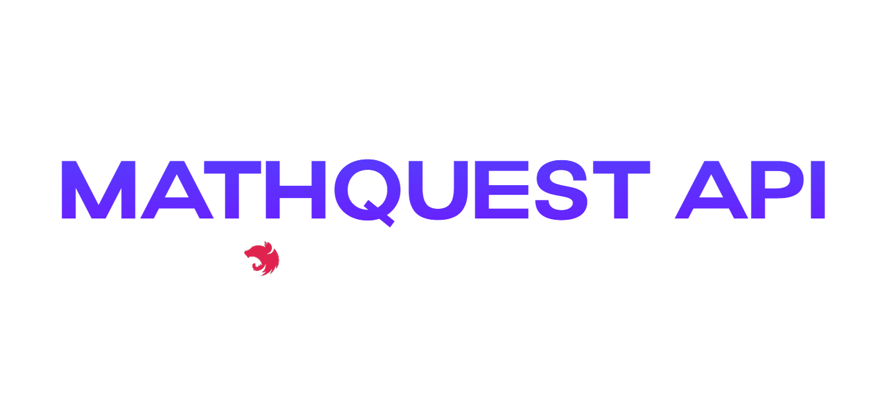

  

**Class proyect: `A`**

Esto es una api de preguntas matematicas de operaciones, creada en Yasson projects, este proyecto esta en fase alfa por ahora, si quieres apoyar el proyecto para el hosting recuerda hablar en instagram como @ljuanda_castro para recibir donaciones (solo por nequi colombia)

# Categoria de preguntas
<table>
  <tr>
    <th>Prefijo</th>
    <th>Categoria</th>
  </tr>
  <tr>
    <td>A</td>
    <td>Multiplicacion y division</td>
  </tr>
  <tr>
    <td>B</td>
    <td>Suma y resta</td>
  </tr>
  <tr>
    <td>C</td>
    <td>Potenciación y raices</td>
  </tr>
  <tr>
    <td>D</td>
    <td>Multiplicacion y potenciacion</td>
  </tr>
</table>

# HTTP Requests
Esta es la lista de peticiones que puedes hacer

### GET
<pre><code>https://mathquest-api.onrender.com/api</code></pre>
<pre><code>https://mathquest-api.onrender.com/api/mathquestion/all</code></pre>
<pre><code>https://mathquest-api.onrender.com/api/mathquestion/{id}</code></pre>
<pre><code>https://mathquest-api.onrender.com/api/mathquestion/random</code></pre>
<pre><code>https://mathquest-api.onrender.com/api/mathquestion/random/{category}</code></pre>

### POST
Maximo de peticiones post son de 100 recuerda que si quieres reiniciar tus request unete al servidor de [discord](https://discord.gg/jDHbvhzPmQ) de acuerdo a tus necesidades
<pre><code>https://mathquest-api.onrender.com/api/mathquestion/create</code></pre>

### Esquema preguntas
Este esquema de preguntas se envia en el requerimiento de body tipo json:
<pre>
  <code>
  {
    "category": "",
    "question": "",
    "r1": ,
    "r2": ,
    "r3": ,
    "r4": ,
    "correct": 
  }
  </code>
</pre>
[!] - *En las propiedades r1, r2.. va un numero entero por ahora no soporta decimales*

## Soporte 

Tienes alguna duda o deseas reportar algún problema de la api unete a nuestro [discord](https://discord.gg/jDHbvhzPmQ), tambien contactame por instagram como [ljuanda_castro](https://www.instagram.com/ljuanda_castro/) ;)